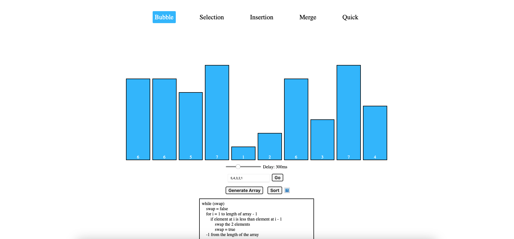
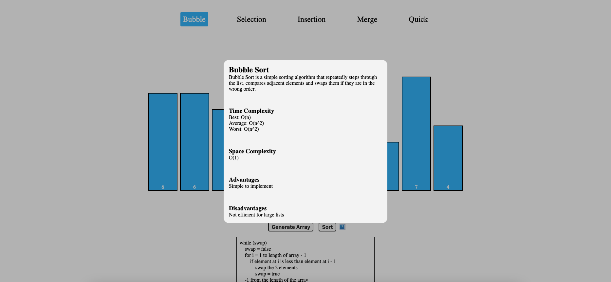

# Visual algorithm sorting

This is a web app designed to help people visualize the sorting process of different popular sorting algorithms through animations like compare, swap, and more. There is also pseudo code written for each algorithm with different parts of the code being highlighted based on its current process, in addition, a modal that provides the user with a description of the algorithm, its complexity, and advantages and disadvantages.

# React + Vite

This template provides a minimal setup to get React working in Vite with HMR and some ESLint rules.

Currently, two official plugins are available:

- [@vitejs/plugin-react](https://github.com/vitejs/vite-plugin-react/blob/main/packages/plugin-react/README.md) uses [Babel](https://babeljs.io/) for Fast Refresh
- [@vitejs/plugin-react-swc](https://github.com/vitejs/vite-plugin-react-swc) uses [SWC](https://swc.rs/) for Fast Refresh
